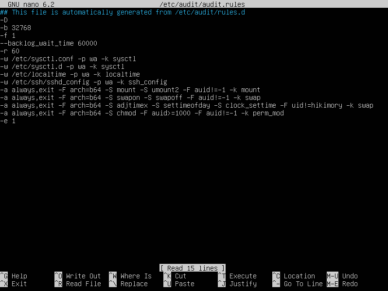

# Ansible Role: auditd

Install and configure auditd on Linux servers.

## Requirements

No special requirements; note that this role requires root access, so either run it in a playbook with a global `become: yes`, or invoke the role in your playbook like:

```yaml
- hosts: servers
  become: true
  roles:
    - role: auditd
```

Specify root or any other user with sudo privileges as the remote user.
There are two ways you can do this:

### 1. ansible.cfg file

```ini
[defaults]
inventory = hosts.yml
private_key_file = ~/.ssh/key
stdout_callback = yaml
stderr_callback = yaml
remote_user = root
```

### 2. hosts file

```yaml
web_servers:
  hosts:
    master1:
      ansible_host: 192.168.0.105
db_servers:
  hosts:
    worker1:
      ansible_host: 192.168.0.110
servers:
  children:
    web_servers:
    db_servers:
```

### 3. auditd.conf file
Add your configuration settings to the auditd.conf file (see `files/auditd.conf`)

## Role Variables

The default values for the variables are set in (see `defaults/main.yml`):

```yaml
# defaults file for auditd
auditd_buffer_size: 32768
auditd_fail_mode: 1
auditd_default_arch: b64
auditd_maximum_rate: 60
auditd_enable_flag: 1
auditd_manage_config: false
```
If you want to add custom audit.conf file set `auditd_manage_config` to true and update audit.conf file in `files/audit.conf` folder. (see `files/audit.conf`)

If you want to add rules for auditing, specify the options for the `auditd_file_rules` and `auditd_action_rules` variables. (see `vars/main.yml`):

```yaml
auditd_file_rules: []
# - file: path
#   permissions: rwxa
#   filters:
#     - filter1=value1
#     - filter1=value2
#   keyname: keyname

auditd_action_rules: []
# - action: 'always,exit'
#   arch: b64
#   syscalls:
#     - syscall
#     - syscall
#   filters:
#     - filter1=value1
#     - filter1=value2
#   keyname: keyname
```

## Example Playbook

### List of rules:
```
auditctl -w /etc/sysctl.conf -p wa -k sysctl
auditctl -w /etc/sysctl.d -p wa -k sysctl
auditctl -w /etc/localtime -p wa -k localtime
auditctl -a always,exit -F arch=b64 -S mount -S umount2 -F auid!=-1 -k mount
auditctl -a always,exit -F arch=b64 -S swapon -S swapoff -F auid!=-1 -k swap
auditctl -a always,exit -F arch=b64 -S chmod -F auid>=1000 -F auid!=-1 -k perm_mod
```

```yaml
- hosts: servers
  become: true
  roles:
    - role: auditd
      auditd_file_rules:
        - file: /etc/sysctl.conf
          permissions: wa
          keyname: sysctl
        - file: /etc/sysctl.d
          permissions: wa
          keyname: sysctl
        - file: /etc/localtime
          permissions: wa
          keyname: localtime
      auditd_action_rules:
        - action: 'always,exit'
          arch: b64
          syscalls:
            - mount
            - umount2
          filters:
            - auid!=-1
          keyname: mount
        - action: 'always,exit'
          arch: b64
          syscalls:
            - swapon
            - swapoff
          filters:
            - auid!=-1
          keyname: swap
        - action: 'always,exit'
          arch: b64
          syscalls:
            - adjtimex
            - settimeofday
            - clock_settime
          filters:
            - uid!=hikimory
          keyname: swap
        - action: 'always,exit'
          arch: b64
          syscalls:
            - chmod
          filters:
            - auid>=1000
            - auid!=-1
          keyname: perm_mod
```

# Preview


## License

MIT / BSD

## Author Information

This role was created in 2023 by [Nick Bykon](https://github.com/hikimory).
